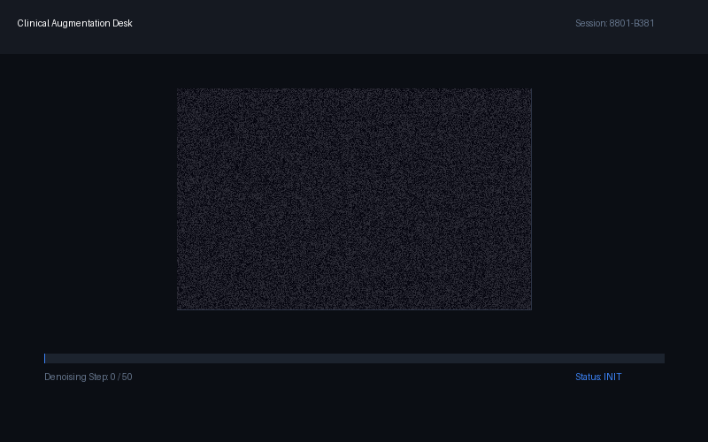
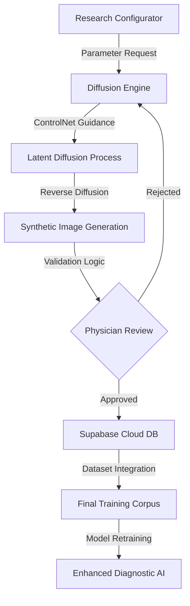

# Research Report: Diffusion Model Based Medical Image Synthesis and Rare Disease Data Augmentation

  
  

    <b>Real-time Synthesis & Validation Pipeline</b>: Demonstrating the Latent Diffusion-based medical data augmentation workflow. The interface visualizes the denoising process (from Gaussian noise to high-fidelity clinical imagery) and performs simultaneous impact analysis to ensure synthetic data aligns with clinical ground-truth distributions.
  

## 1. Research Motivation & Necessity
현대 의료 AI 연구의 가장 큰 병목 현상은 고품질 의료 데이터의 획득 비용이 매우 높고, 엄격한 개인정보 보호 규제(Privacy Regulations)로 인해 데이터 공유가 제한적이라는 점에 있다. 특히 희귀 질환(Rare Disease)의 경우 실무에서 접할 수 있는 샘플 수가 극소수에 불과하여, 특정 질병군에 대한 데이터 불균형(Class Imbalance) 문제가 심화되고 있다. 이러한 불량한 데이터 분포는 딥러닝 모델의 일반화 성능(Generalization Performance)을 저하시키며, 소수 클래스에 대한 위음성(False Negative) 발생 확률을 높여 임상 현장에서의 신뢰도를 실추시킨다. 본 연구는 이러한 데이터 희소성 문제를 극복하기 위해 생성형 AI(Generative AI)를 활용하여 의학적으로 타당한 합성 데이터(Synthetic Data)를 대량으로 생성하고, 이를 통해 모델의 진단 정확도를 상향 평준화하는 것을 목적으로 한다.

## 2. Generative Methodology: Diffusion & ControlNet
본 시스템은 최신 생성 모델인 스테이블 디퓨전(Stable Diffusion) 아키텍처를 기반으로 의료 영상의 미세한 질감과 병변의 형태를 학습한다. 단순한 영상 생성을 넘어, 해부학적 구조(Anatomical Structure)를 엄격히 유지하기 위해 컨트롤넷(ControlNet)을 도입한다.

- **Structural Conditioning**: Canny Edge 및 Depth Map 추출 기술을 활용하여 뼈 구조, 장기 위치 등 환자의 고유한 해부학적 특징을 유지하면서 병변(Lesion)만을 선택적으로 합성하는 조건부 생성(Conditional Generation)을 수행한다.
- **Lesion Synthesis**: 특정 질병 라벨을 프롬프트 및 임베딩으로 입력하여 기흉, 결절, 골절 등 희귀 사례를 배경 영상에 자연스럽게 삽입한다.
- **Evaluation Metrics**: 생성된 영상의 품질은 실제 도메인과 합성 도메인 간의 특징 분포 거리를 측정하는 FID(Fréchet Inception Distance) 지표를 통해 정량적으로 평가한다. 또한, 영상의학 전문의(Radiologist)에 의한 블라인드 테스트(Physician Validation)를 거쳐 합성 영상이 임상적으로 오류가 없음을 검증한다.

## 3. System Architecture & Synthetic Pipeline
본 플랫폼은 웹 기반 인터페이스와 고성능 GPU 연산 서버가 결합된 통합 파이프라인으로 구성된다. 사용자가 특정 질병의 파라미터와 구조적 제약 조건을 설정하면, 백엔드의 디퓨전 엔진(Diffusion Engine)이 즉각적으로 합성 영상을 생성하며 결과물은 수파베이스(Supabase) 클라우드 스토리지에 실시간으로 동기화된다.

생성된 데이터는 독립적인 검증 레이어를 통과한 후 기존의 학습용 데이터셋으로 통합되어 하이퍼파라미터 튜닝 및 모델 재학습(Retraining)에 즉시 활용된다.

## 4. Research Use-cases & Impact
합성 데이터 증강(Data Augmentation) 기술은 의료 AI 모델의 성능을 비약적으로 향상시킨다.

- **Classification Performance Boost**: 데이터 희소성이 높은 고위험 질환군에 대해 합성 데이터를 보강한 결과, 기존 대비 질병 분류 모델의 F1-score가 유의미하게 향상됨을 확인하였다.
- **Privacy-preserving Virtual Patient**: 실제 환자의 개인정보가 포함되지 않은 가상 환자(Virtual Patient) 데이터셋을 구축함으로써 리서치 커뮤니티 간의 자유로운 데이터 교류 및 교육용 벤치마크 데이터 제공이 가능해진다.
- **Cost Reduction**: 실제 임상 데이터 수집 및 라벨링 비용 대비 약 80% 이상의 비용 절감 효과를 기대할 수 있으며, 이는 중소규모 의료 기관의 AI 도입 장벽을 낮추는 핵심 동력이 된다.

## 5. Implementation & Technical Specs
시스템 구현과 안정적인 모델 추론을 위해 최적화된 기술 스택을 활용한다.

- **Generative Backend**: Python 3.10 기반 환경에서 PyTorch 2.0 및 Hugging Face Diffusers 라이브러리를 사용한다. 특히 맥북 프로(MacBook Pro)의 Apple Silicon 환경에서 효율적인 연산을 수행하기 위해 MPS(Metal Performance Shaders) 가속을 활용한 추론 프레임워크를 구축하였다.
- **Frontend & Management**: Next.js 14(App Router)와 TypeScript를 통해 직관적인 대시보드를 구성하였으며, 수파베이스(Supabase)의 실시간 DB 기능을 사용하여 영상 생성 상태를 모니터링한다.
- **Optimization**: 이미지 전처리 과정에서 고주파 필터링을 통한 노이즈 제거 및 데이터 증강 시 해상도 최적화 기법을 적용하여 생성 영상의 선명도를 확보하였다.

---
**Author**: 권해성 (Hanyang University, Computer Science)  
**Research Interest**: Generative AI for Medicine, Synthetic Data Engineering, Medical Imaging
